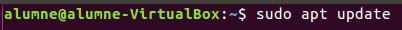
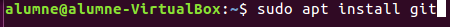

# **INSTALAR GIT** 

-Intalar git

sudo apt update
sudo apt install git

1)Configuració inicial 

-identitat de l´usuari

git config --global user.name "Jordi"
git config --global user.email colladoargente@gmail.com

-Editor per defecte
alumne@alumne:~$ git config --global core.editor vim

-Creació i inicialització del projecte i el repositori

-Es on anem a guardar els projectes
mkdir projecte
-Ara estem dins de ell
cd projecte

-Iniciem asi el repositori
git init 

-si volem vore el estat de git
git status

-creacio de un fitxer nou
touch fitxer_1.md

-borrar fitxers
crem primer 2 per a borrarlos despues

touch gan1.md 
touch gan2.md 

-I veem el estat
Git status 

-Fem un commit
git commit -a -m "2 fitxers de prova"

-Esborrem el fitxer en local
rm tmp1.md