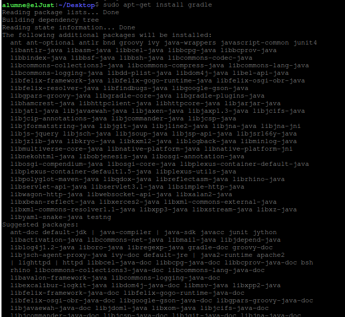
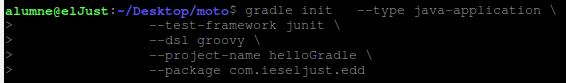

# **Gradle**
```
Tenemos que instalar Gradle:

$sudo apt-ghet instsall gradle
```

```
Ya esta instalat i ara tenim que crear un directori. 

 comando:

mkdir (nom)

```

```
Possem el seguent comando:
```


```
I pa crear el projecte ficarem lo seguent:

$gradle build

$gradle run
```

3.3. Dependències

Entraremos en la pagina oficial ((https://mvnrepository.com/) i instalarem Apache Commons Math:


// https://mvnrepository.com/artifact/org.apache.commons/commons-math3
compile group: 'org.apache.commons', name: 'commons-math3', version: '3.6'


