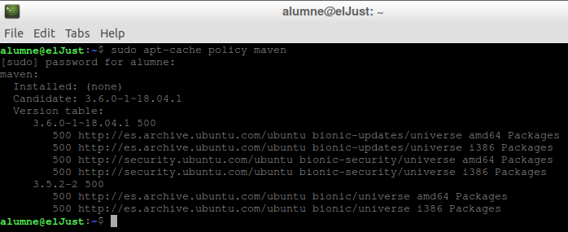
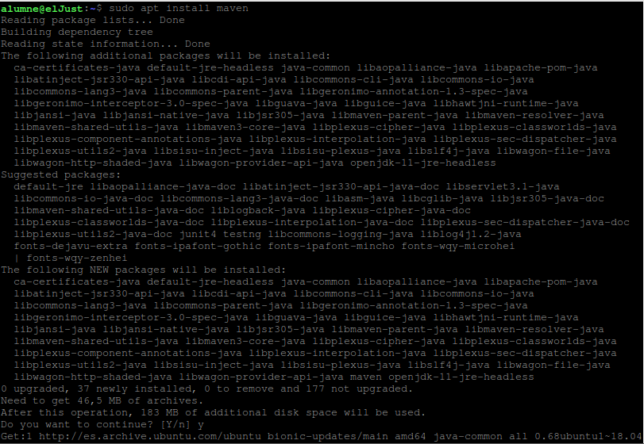
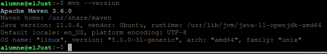
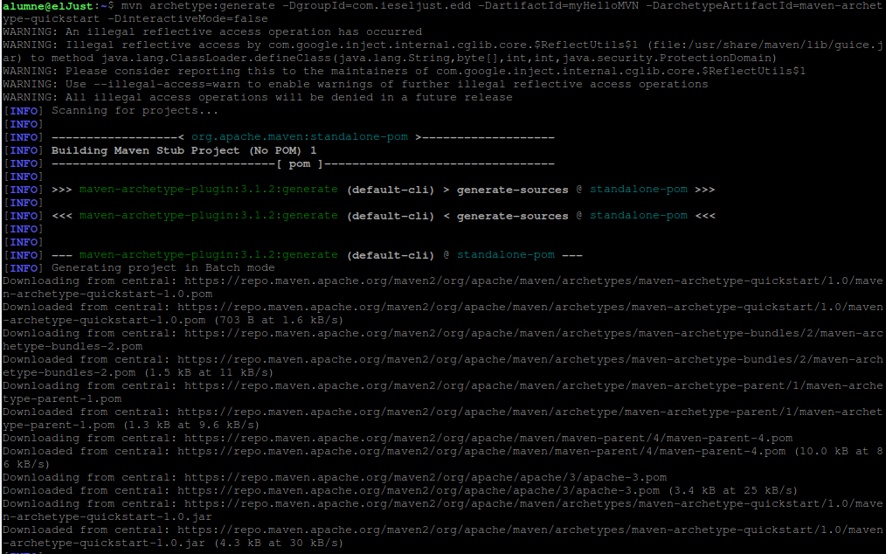
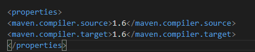

# **Maven** 

1. Inroducció
```
-La construcció d'aplicacions. 

-El manteniment de la documentació i informes.

-La gestió de dependències.

-La gestió dels sistemes de control de versions (VCS).

-L'alliberació de versions (releases).

-La distribució de 
l'aplicació
```
1.1. Instal.lació de Maven en Ubuntu


```
Per a instalar el paquete, tenim que entrar en administrasdor:

$sudo apt update

$sudo apt install maven
```



```
Ara tenim que comprovar si tenim instalat Maven en el sistema:

$mvn --version
```



```
2.1 Generació delprojecte a partir de arquetipus
```


Per evitar un error  tindrem que ficar aso :



