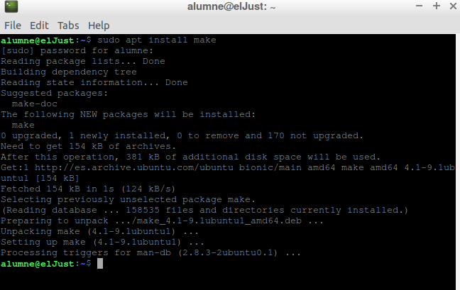
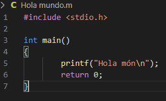
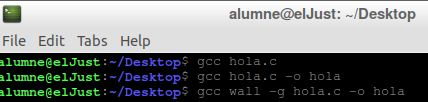
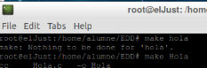
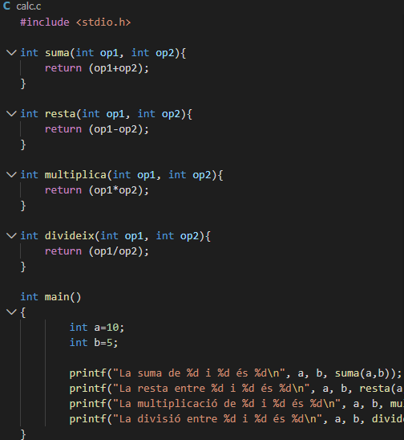
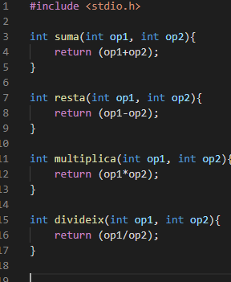
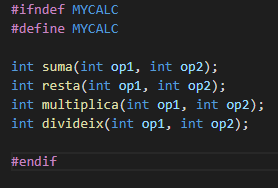

#    **Make**


Lo primero instalaremos make : sudo apt install make


Copilant un "Hola Mundo"



Per a copilar el fichero:
```
gcc hola.c

gcc hola.c -hola

gcc -wall -g hola.c -o hola
```


Utilizamos make: make hola



Fixero de codi C
```
calcula.c
```


Tindra implementadas las funciones
```
calc.c
```


Conte les cabezeras de estes funcions
```
calc.h
```


1.Obtindre el fitxer    
Objecto(calc.o) a partir de (calc.c)

2.Obtenemos el fixero   executable calcula, a partir de l'objecte calc.o i el propi font calcula.c  
Ponemos este comando:
```
gcc calc.o calcula.c -o calcula
```
Ahora podremos ejexutar nuestro programa:
```
$ ./calcula  
La suma de 10 i 5 és 15     
La resta entre 10 i 5 és 5  
La multiplicació de 10 i 5 és 50    
La divisió entre 10 i 5 és 2
```

**TO-DO**
```
1.Crearemos el primer progama de la calculadora. 

2.Creamos una nueva función que se llame major,tiene que salir alfinal algo asi parecido :

El major entre 10 y 5 es 10

3.Hazemos el mismo ejemplo con el siguiente ejemplo.

4.Por ultimo tenemos que copilar el segundo y tenemos que ver si todo funciona correctamente.
```


